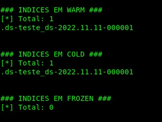

# node-index
Lista os indices separados por fase (Hot, Warm, Cold, Frozen)

Para executar o script será necessário informar:
1. Endpoint do Elasticsearch
2. Usuário e senha com permissão de acesso.

O retorno esperado é semelhante ao abaixo:

